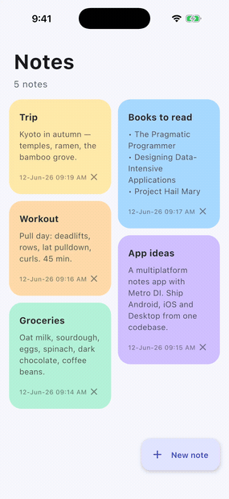

<h1 align="center">Material Notes</h1>

<p align="center">
  <a href="https://opensource.org/licenses/Apache-2.0"></a>
  <a href="https://android-arsenal.com/api?level=24"></a>
   <br>
  
  
  
  
  
  
</p>

<p align="center">
📝 Material Notes is a clean, Material 3 note-taking app built with Compose Multiplatform — running on Android, iOS, and Desktop from a single shared, multi-module codebase, with Navigation 3, SQLDelight, Metro DI, Coroutines, Flow, email/Google/Apple sign-in and per-user cloud sync via a Supabase KMP SDK, and a card-to-detail shared-element transition based on MVVM architecture.
</p>

<p align="center">
  
</p>

> [!TIP]
> The same Compose UI and logic run natively on Android, iOS, and Desktop (JVM) — split across `:core` and `:feature` Kotlin Multiplatform modules.

## Running

- **Android** — `./gradlew :composeApp:assembleDebug`, or run the `composeApp` configuration in Android Studio.
- **Desktop** — `./gradlew :composeApp:run`
- **iOS** — open `iosApp/iosApp.xcodeproj` in Xcode, set your signing **TEAM_ID** in
  `iosApp/Configuration/Config.xcconfig`, pick a simulator, and run. The "Compile Kotlin Framework"
  build phase invokes Gradle to build the shared framework.

## Tech stack & Open-source libraries

- Minimum SDK level 24 · targets **Android, iOS, and Desktop (JVM)**.
- [Kotlin](https://kotlinlang.org/) based, with [Coroutines](https://github.com/Kotlin/kotlinx.coroutines) and [Flow](https://kotlinlang.org/docs/flow.html) for async streams.
- Compose Multiplatform Libraries:
  - [Compose Multiplatform](https://www.jetbrains.com/lp/compose-multiplatform/) — declarative UI + Material 3.
  - Lifecycle & ViewModel — `org.jetbrains.androidx.lifecycle` (multiplatform).
  - [Navigation 3](https://developer.android.com/guide/navigation/navigation-3) — `NavDisplay` + `entryProvider` with type-safe `NavKey` routes and entry-scoped ViewModels (`org.jetbrains.androidx.navigation3`).
  - [SQLDelight](https://github.com/cashapp/sqldelight) — typesafe SQL with platform drivers (Android / native / JDBC).
- [Supabase KMP SDK](https://github.com/AndroidPoet/supabase-kmp) — `io.github.androidpoet:supabase-*` — email/Google/Apple **auth** (`supabase-auth`) plus per-user two-way cloud note sync (push + pull), offline-first.
- [Metro](https://github.com/ZacSweers/metro) — compile-time dependency injection (a Kotlin compiler plugin), wired across modules.
- Architecture:
  - MVVM Architecture (View → ViewModel → Repository → SQLDelight queries).
  - Repository Pattern.
  - Multi-module: `:core:data`, `:core:designsystem`, `:feature:*`, `:composeApp`.
- [kotlinx-datetime](https://github.com/Kotlin/kotlinx-datetime) — multiplatform date/time formatting.
- **Shared-element transition** — `SharedTransitionLayout` + `sharedBounds` morph the note card into the detail screen (the `AnimatedVisibilityScope` comes from Nav3's `LocalNavAnimatedContentScope`).

## Architecture

Material Notes follows MVVM across a **multi-module** Kotlin Multiplatform setup. Each module targets
Android, Desktop (JVM), and iOS; the app shell assembles them and the Metro graph wires dependencies
across module boundaries at compile time.

```
:composeApp          # App shell: App, AppNavHost (Nav3), Metro AppGraph, platform entry points
:core:data           # Note, MainRepository, SQLDelight schema + drivers (Android / native / JDBC)
:core:designsystem   # Theme, palette, icons, shared-element helpers, date util
:feature:auth        # AuthScreen (login / sign-up) + AuthViewModel
:feature:home        # HomeScreen + NotesViewModel
:feature:addnote     # AddNoteScreen + AddNoteViewModel
:feature:detail      # NoteDetailScreen + NoteDetailViewModel
iosApp/              # Xcode project (SwiftUI shell hosting the Compose UI)
```

Dependencies flow one way — `:composeApp → :feature:* → :core:*` — so the graph stays acyclic. Feature
screens receive their ViewModel as a parameter; `AppNavHost` (which can see both the Metro graph and the
screens) creates each entry-scoped ViewModel and passes it down. Each platform supplies a SQLDelight
`SqlDriver` (`:core:data/.../DatabaseDriver.*.kt`) into `buildAppGraph(driver, ioDispatcher)`. Because Metro
validates the graph at compile time, a wiring mistake fails the build instead of crashing at runtime.

### Auth + cloud sync (Supabase) — live demo

This repo ships pointed at a **real, live Supabase project**, so you can clone, run, sign up, and watch
your notes sync against the cloud with zero setup. It's a working showcase of [AndroidPoet's Supabase KMP
SDK](https://github.com/AndroidPoet/supabase-kmp) end-to-end.

**Sign in.** On launch the app shows a login screen (`:feature:auth`). Create an account or sign in with
**email + password** — handled by `supabase-auth` via `AuthService`. **Google** (Android) and **Apple**
(iOS/macOS) buttons are wired in and light up once their OAuth providers are enabled on the project.

**Per-user sync.** Notes live locally in SQLDelight and the app is fully usable offline. The **Sync**
button in the home header does an explicit two-way sync: it upserts every local note up to the Supabase
`notes` table, then pulls the table back down — so a note saved on any device converges everywhere. Both
directions are **paged** (batched upserts; a count-aware `selectWithCount` + PostgREST `range` walk on the
pull) so the sync scales to a large notebook. Every request carries the signed-in user's JWT, and a
`user_id` column + Row Level Security scope every row to its owner, so each account sees only its own notebook.

**Security.** The app uses only the project URL and the public **anon** key — designed to ship in clients
and constrained entirely by RLS (see [`supabase/schema.sql`](supabase/schema.sql)). The `service_role` key
bypasses RLS and is **never** used in the client. Credentials are **kept out of source control**: they are
read at build time from `local.properties` (or `SUPABASE_URL` / `SUPABASE_ANON_KEY` env vars) into a
generated `SupabaseSecrets` (see `core/data/build.gradle.kts`). To run against your own project, add to
`local.properties`:

```properties
supabase.url=https://YOUR-REF.supabase.co
supabase.anonKey=YOUR-ANON-KEY
```

and apply the schema with `supabase db push` (or paste [`supabase/schema.sql`](supabase/schema.sql) into the
SQL Editor). Leave them unset and the app simply runs offline.

> [!NOTE]
> Auth lives in `:core:data` under `.../data/auth/` (`AuthService`, `SessionStore`, `SocialAuthService`)
> and the sync in `.../data/sync/` (`SupabaseConfig`, `SupabaseProvider`, `RemoteNote`, `NoteSyncService`).
> A single auth-aware `SupabaseProvider` client feeds both, wired via Metro; the `SessionStore` flow gates
> navigation between the login screen and the notes app.

### Version matrix

Kotlin 2.4.0 · Compose Multiplatform 1.11.1 · Navigation 3 1.1.0 · AGP 8.11.1 · SQLDelight 2.3.2 ·
Metro 1.2.0 · Supabase KMP 0.6.0 · Lifecycle (JB) 2.10.0 · Gradle 8.14 · JDK 21 (see `gradle/libs.versions.toml`).

> [!NOTE]
> **Toolchain notes.** The Supabase KMP SDK 0.6.0 is built with Kotlin 2.4.0, so the app tracks the same
> toolchain: Kotlin 2.4.0 with Metro 1.2.0 (its Gradle plugin pins the Kotlin plugin to 2.4.x) and
> Compose Multiplatform 1.11.1. Metro requires **JDK 21** + Gradle 8.13+ — `gradle/gradle-daemon-jvm.properties`
> selects the JDK 21 toolchain automatically. On iOS, SQLDelight's native driver (SQLiter) needs the app to link `-lsqlite3`
> (in `OTHER_LDFLAGS`), and `CADisableMinimumFrameDurationOnPhone=true` must be set in
> `iosApp/iosApp/Info.plist`. `material-icons-extended` is no longer published for CMP 1.8+, so the few
> icons used are hand-authored `ImageVector`s.

## Contributing

Contributions are welcome! If you've found a bug, have an idea for an improvement, or want to contribute new features, please open an issue or submit a pull request.

## Find this repository useful? :heart:
Support it by joining __[stargazers](https://github.com/AndroidPoet/Material-Notes/stargazers)__ for this repository. :star: <br>
Also, __[follow me](https://github.com/AndroidPoet)__ on GitHub for my next creations! 🤩

# License
```xml
Designed and developed by 2026 AndroidPoet (Ranbir Singh)

Licensed under the Apache License, Version 2.0 (the "License");
you may not use this file except in compliance with the License.
You may obtain a copy of the License at

   http://www.apache.org/licenses/LICENSE-2.0

Unless required by applicable law or agreed to in writing, software
distributed under the License is distributed on an "AS IS" BASIS,
WITHOUT WARRANTIES OR CONDITIONS OF ANY KIND, either express or implied.
See the License for the specific language governing permissions and
limitations under the License.
```
